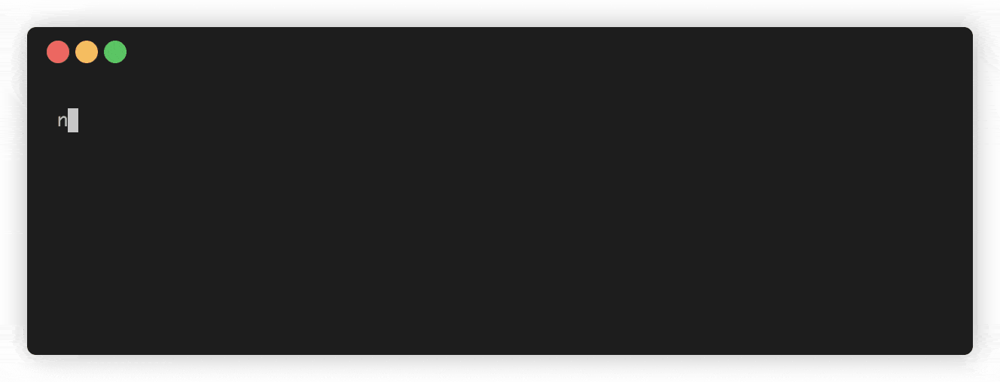

# Radius Workspace - A Design System Boilerplate Generator

## Background

The Radius design system starter kit is a collection of open-source tools and libraries developed by Rangle to guide devs to build design systems faster. Design systems need to match increasingly flexible brand and product needs, to adapt to everchanging digital workflows.

`radius-workspace` is 1 of 3 repositories that constitute the Radius ecosystem for accelerating the building of design systems!

This workspace reflects our internal R&D efforts to:

- automate the generation of design system starter boilerplates with a CLI
- offer the choice of popular choices around tooling, JS frameworks and style libraries
- enable the easy translation of Figma design tokens into styles within your new boilerplate that your dev team can readily work with and scale

See also:

- [npm package](https://www.npmjs.com/package/radius-script) for our CLI Tool
- [Radius-Angular](https://github.com/rangle/radius-angular)
- [Radius[for React]](https://github.com/rangle/radius)
- [rangle.io/radius](https://rangle.io/radius)
- [Radius Design Kit](https://www.figma.com/file/RqENxZWAzGiEWM7COch1Sc/Radius-Design-Kit) on Figma

## Key Features

Use the CLI to:

- Generate design tokens from Figma URL
- Generate a design system repository
- WIP: Publish your generated design system to the npm registry

## Try Out the CLI



1. Create a new design system project folder by running `npx radius-script init`
1. Select your framework of choice, name your project folder, and `cd` into it.
1. Run `npm install` to install all dependencies
1. Extract tokens from Figma `npx radius-script styles`

## Requirements

To use Radius node version `14+` is needed

### Setup Dev

Enable yarn workspaces:
`yarn config set workspaces-experimental true`

Install dependencies:
`lerna bootstrap`

## Create Design System instances with the Radius CLI Locally

1. Instantiate a design system boilerplate!
   `npm cli:init` or `yarn cli:init`

2. Bootstrap the styles with Figma URL!

Pre-requisites:

- a Figma URL
- a Figma token
- optional environment variables for `packages/cli/.env` : `FIGMA_URL`, `FIGMA_TOKEN`

`npm cli:styles` or `yarn cli:styles`

## Tooling

- lerna for package distribution and publishing: uses yarn under the hood to pull dependencies
- husky for pre-commit actions, testing and linting
- eslint for formatting
- github actions for CI/CD
- tsnode for debugging
- jest for unit tests
- commitizen for conventional commit messages

## What's Inside

```
.
├── .github
    └── workflows/
├── .gitignore
├── .vscode/
├── CODE_OF_CONDUCT.md
├── CONTRIBUTING.md
├── DSMODULES.md
├── LICENSE
├── README.md
├── jest.config.base.js
├── jest.config.js
├── lerna.json
├── package.json
├── packages
│   └── cli
        └── bin/
        └── coverage/
        └── dist/
        └── node_modules/
        └── src/
├── tsconfig.json
└── tsconfig.paths.json

```

## Contributing

Want to help us improve this, or hoping to see your favorite libraries or build tools integrated?
See [CONTRIBUTING.md](./CONTRIBUTING.md)

## License

- TODO - Make sure this is the right license

[MIT](./LICENSE)

## Acknowledgments

- PR template is taken from [here](https://embeddedartistry.com/blog/2017/08/04/a-github-pull-request-template-for-your-projects/)
- License was generated [here](https://choosealicense.com/licenses/mit/)
- Referenced this [for the contributing doc](https://gist.github.com/briandk/3d2e8b3ec8daf5a27a62)
